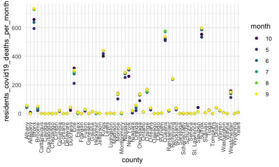

Nursing home data edit
================
Minjie Bao
2020-11-19

``` r
library(tidyverse)
```

    ## ── Attaching packages ─────────────────────────────────────── tidyverse 1.3.0 ──

    ## ✓ ggplot2 3.3.2     ✓ purrr   0.3.4
    ## ✓ tibble  3.0.4     ✓ dplyr   1.0.2
    ## ✓ tidyr   1.1.2     ✓ stringr 1.4.0
    ## ✓ readr   1.4.0     ✓ forcats 0.5.0

    ## ── Conflicts ────────────────────────────────────────── tidyverse_conflicts() ──
    ## x dplyr::filter() masks stats::filter()
    ## x dplyr::lag()    masks stats::lag()

``` r
knitr::opts_chunk$set(
  fig.width = 6,
  fig.asp = .6,
  out.width = "90%"
)
theme_set(theme_minimal() +  theme(legend.position = "bottom"))

options(
  ggplots2.continuous.color = "viridis",
  ggplots2.continuous.fill = "viridus"
)

scale_colour_discrete = scale_colour_viridis_d
scale_fill_discrete = scale_fill_viridis_d
```

``` r
# Read in Covid Nursing Home data and filter data from only NY state
NHCovid_df = 
  read_csv("./Data/COVID-19 Nursing Home Data - Archived Data - Week Ending 10_25_20.csv") %>% 
  janitor::clean_names() %>% 
  filter(provider_state == "NY")
```

    ## 
    ## ── Column specification ────────────────────────────────────────────────────────
    ## cols(
    ##   .default = col_character(),
    ##   `Provider Zip Code` = col_double(),
    ##   `Residents Weekly Admissions COVID-19` = col_double(),
    ##   `Residents Total Admissions COVID-19` = col_double(),
    ##   `Residents Weekly Confirmed COVID-19` = col_double(),
    ##   `Residents Total Confirmed COVID-19` = col_double(),
    ##   `Residents Weekly Suspected COVID-19` = col_double(),
    ##   `Residents Total Suspected COVID-19` = col_double(),
    ##   `Residents Weekly All Deaths` = col_double(),
    ##   `Residents Total All Deaths` = col_double(),
    ##   `Residents Weekly COVID-19 Deaths` = col_double(),
    ##   `Residents Total COVID-19 Deaths` = col_double(),
    ##   `Number of All Beds` = col_double(),
    ##   `Total Number of Occupied Beds` = col_double(),
    ##   `COVID-19 Point-of-Care Tests Performed on Residents Since Last Report` = col_double(),
    ##   `COVID-19 Point-of-Care Tests Performed on Staff and/or Personnel Since Last Report` = col_double(),
    ##   `Staff Weekly Confirmed COVID-19` = col_double(),
    ##   `Staff Total Confirmed COVID-19` = col_double(),
    ##   `Staff Weekly Suspected COVID-19` = col_double(),
    ##   `Staff Total Suspected COVID-19` = col_double(),
    ##   `Staff Weekly COVID-19 Deaths` = col_double()
    ##   # ... with 8 more columns
    ## )
    ## ℹ Use `spec()` for the full column specifications.

    ## Warning: 40533 parsing failures.
    ##  row                                       col           expected actual                                                                           file
    ## 1841 Number of Ventilators in Facility         1/0/T/F/TRUE/FALSE     13 './Data/COVID-19 Nursing Home Data - Archived Data - Week Ending 10_25_20.csv'
    ## 1841 Any Current Supply of Ventilator Supplies 1/0/T/F/TRUE/FALSE     Y  './Data/COVID-19 Nursing Home Data - Archived Data - Week Ending 10_25_20.csv'
    ## 1841 One-Week Supply of Ventilator Supplies    1/0/T/F/TRUE/FALSE     Y  './Data/COVID-19 Nursing Home Data - Archived Data - Week Ending 10_25_20.csv'
    ## 1842 Number of Ventilators in Facility         1/0/T/F/TRUE/FALSE     13 './Data/COVID-19 Nursing Home Data - Archived Data - Week Ending 10_25_20.csv'
    ## 1842 Any Current Supply of Ventilator Supplies 1/0/T/F/TRUE/FALSE     Y  './Data/COVID-19 Nursing Home Data - Archived Data - Week Ending 10_25_20.csv'
    ## .... ......................................... .................. ...... ..............................................................................
    ## See problems(...) for more details.

``` r
nystate_df = 
  read_csv("./Data/nystate.csv") %>% 
  janitor::clean_names() %>% view()
```

    ## 
    ## ── Column specification ────────────────────────────────────────────────────────
    ## cols(
    ##   .default = col_double(),
    ##   `Week Ending` = col_character(),
    ##   `Provider Name` = col_character(),
    ##   `Submitted Data` = col_character(),
    ##   `Shortage of Nursing Staff` = col_character(),
    ##   `Shortage of Clinical Staff` = col_character(),
    ##   `Shortage of Aides` = col_character(),
    ##   `Shortage of Other Staff` = col_character(),
    ##   `One-Week Supply of N95 Masks` = col_character(),
    ##   `One-Week Supply of Surgical Masks` = col_character(),
    ##   `One-Week Supply of Eye Protection` = col_character(),
    ##   `One-Week Supply of Gowns` = col_character(),
    ##   `One-Week Supply of Gloves` = col_character(),
    ##   `One-Week Supply of Hand Sanitizer` = col_character(),
    ##   `Ventilator Dependent Unit` = col_character(),
    ##   `One-Week Supply of Ventilator Supplies` = col_character(),
    ##   County = col_character()
    ## )
    ## ℹ Use `spec()` for the full column specifications.

    ## Warning: 46 parsing failures.
    ##   row                     col               expected actual                 file
    ## 14137 Federal Provider Number no trailing characters 33A081 './Data/nystate.csv'
    ## 14138 Federal Provider Number no trailing characters 33A081 './Data/nystate.csv'
    ## 14139 Federal Provider Number no trailing characters 33A081 './Data/nystate.csv'
    ## 14140 Federal Provider Number no trailing characters 33A081 './Data/nystate.csv'
    ## 14141 Federal Provider Number no trailing characters 33A081 './Data/nystate.csv'
    ## ..... ....................... ...................... ...... ....................
    ## See problems(...) for more details.

``` r
# Break down specific date into month
NHCovid_df_by_month = 
  nystate_df %>% 
  separate(week_ending, into = c("month", "day", "year"), sep ="/") %>% 
  mutate(
    month = str_replace(month, "5", "05"),
    month = str_replace(month, "6", "06"),
    month = str_replace(month, "7", "07"),
    month = str_replace(month, "8", "08"),
    month = str_replace(month, "9", "09"),
    month = factor(month, levels = c("05", "06", "07", "08", "09", "10"))
    )
```

``` r
# data (Summarize monthly death)
NHCovid_df_county_monthly_death =
  NHCovid_df_by_month %>% 
  # to eliminate N/A, filter by submitted data and quality check
  filter(submitted_data == "Y") %>% 
  group_by(month, county) %>% 
  summarise(residents_covid19_deaths_per_month = sum(residents_weekly_covid_19_deaths)) %>% 
  drop_na()
```

    ## `summarise()` regrouping output by 'month' (override with `.groups` argument)

``` r
#plot
monthly_death_plot =
ggplot(NHCovid_df_county_monthly_death, aes(x = county, y = residents_covid19_deaths_per_month, color = month)) +
  geom_point() +
  theme(axis.text.x = element_text(angle = 90, vjust = 0.5, hjust = 1)) +
  theme(legend.position = "right") 

monthly_death_plot
```


``` r
#data
NHCovid_df_county_monthly_confirmed = 
  NHCovid_df_by_month %>% 
  # to eliminate N/A, filter by submitted data and quality check
  filter(submitted_data == "Y") %>% 
  group_by(month, county) %>% 
  summarise(residents_covid19_cases_per_month =  sum(residents_weekly_confirmed_covid_19)) %>% drop_na()
```

    ## `summarise()` regrouping output by 'month' (override with `.groups` argument)

``` r
#plot
monthly_confirmed_plot =
ggplot(NHCovid_df_county_monthly_confirmed, aes(x = county, y = residents_covid19_cases_per_month, color = month)) +
  geom_point() +
  theme(axis.text.x = element_text(angle = 90, vjust = 0.5, hjust = 1)) +
  theme(legend.position = "right") 

monthly_confirmed_plot
```


``` r
#data
NHCovid_df_mortality = 
  left_join(NHCovid_df_county_monthly_death, NHCovid_df_county_monthly_confirmed, by = c("county", "month")) %>% 
  mutate(mortality = residents_covid19_deaths_per_month/residents_covid19_cases_per_month) %>% 
  drop_na()

#plot
monthly_mortality_plot =
ggplot(NHCovid_df_mortality, aes(x = county, y = mortality, color = month)) +
  geom_point() +
  theme(axis.text.x = element_text(angle = 90, vjust = 0.5, hjust = 1)) +
  theme(legend.position = "right") 

monthly_mortality_plot
```


combine shortage of stuff

``` r
#data
shortage_of_stuff =
NHCovid_df_by_month %>% 
  filter(submitted_data == "Y") %>% 
  select(month, county, starts_with("shortage")) %>% 
    mutate(
     total_shortage = case_when(
      shortage_of_nursing_staff != "N" ~ "Y",
      shortage_of_clinical_staff != "N" ~ "Y",
      shortage_of_aides != "N" ~ "Y",
      shortage_of_other_staff != "N" ~ "Y"
    )
  ) %>% 
  drop_na()

#plot
shortage_of_stuff_plot =
ggplot(shortage_of_stuff, aes(x = county, y = month, color = month)) +
  geom_point() +
  theme(axis.text.x = element_text(angle = 90, vjust = 0.5, hjust = 1)) +
  theme(legend.position = "right") 

shortage_of_stuff_plot
```


